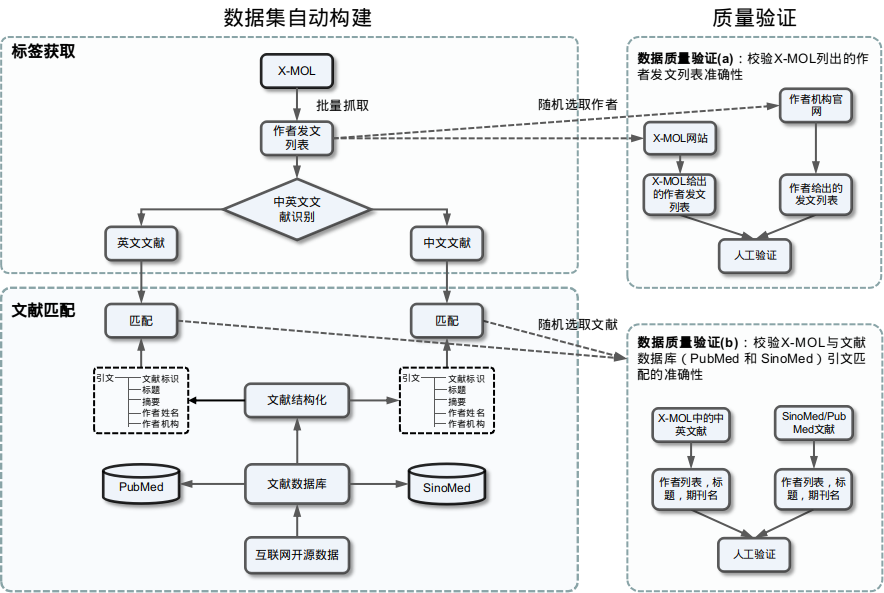

# CHEN-AND：面向中英文文献联合作者消歧研究的基准测试

### 简介
目前，主流的学术文献数据库主要为英文文献数据库。然而，除了这些英文文献数据库，还存在许多其它语种的文献数据库。这些文献数据库都存在一个共性问题——文献作者的歧义问题。事实上，作者姓名歧义问题不仅存在于英文文献数据库中，还存在于各种非英文文献数据库中，因为具有不同文化环境的研究人员都不约而同地使用了数量较少的常见姓名，根据族裔数据集Ethnea的统计结果，在中国、韩国、日本和英语地区，最常见的100个姓氏所覆盖的研究人员占整个研究群体的比例分别为74.26%、67.68%、40.72%和24.30%。此外，一个直观的反映非英文文献数据库中作者姓名歧义问题的例子是，中国生物医学文献服务系统SinoMed中署名为“王伟”的文献数量接近3万条，而这些检索记录并非全部来自同一个作者。
然而，作者消歧研究主要集中在英文文献上，对跨文献数据库联合作者消歧研究的关注较少。虽然目前存在一些与之相似的研究，但这些研究的研究对象和研究目标设置与我们研究有着较大的差别，如刘玮辰等人提出一种针对华人作者消歧的方法，解决的是英文文献数据库WoS中华人作者的姓名歧义问题。

这里，我们研究了不同语种文献中的作者姓名歧义问题，提出了一种新的研究任务——中英文文献联合作者消歧研究，并为该研究一个数据集CHEN-AND，以及一个公开的基准测试组件。

### 数据集构建方法
由于该研究任务目前还未有公开可用的数据集，我们构建了一个数据集CHEN-AND，[下载地址](https://zenodo.org/record/7654431)（需要翻墙）。为了构建一个足够大的数据集，我们提出了一种自动构建数据集的方法，而非通过人工标注创建数据集。数据集构建方法如图\ref{fig:中英文联合作者消歧数据集构建方法}所示，该方法主要包含标签获取、文献匹配、质量验证等环节。
这里的标签信息指的是一个作者发表的中文文献和英文文献列表，为了能够获得大量的标签数据，我们最终选用了一个国内的学术资源站点[X-MOL](https://www.x-mol.com/aboutUs)，从其公开的信息中抓取大量高质量的作者-文献标签数据。X-MOL是一个中文科学知识平台，专注于化学和生物医学领域，目前该平台汇集了大量的研究人员的基本信息。在X-MOL站点中，研究人员的发表列表位于该站点的“全球导师”板块中。这个板块展示的信息是可靠的，据介绍，平台的信息由专业团队维护，团队中大多数人拥有化学、生物学、药学等领域的硕士或博士学位。

为了将“外部标签”赋予数据集，需要进行文献匹配，将“外部标签”与目标文献数据库中具体的文献和作者关联起来，实现“外部标签”到“内部标签”的转化。这是因为数据集是为文献数据库构建的，数据集中的文献信息应该来自这些文献数据库。
当文献匹配完成后，数据集就被自动地构建了。考虑到自动构建过程包含一些不可控的因素，如外部标签信息的准确性，可能会引发使用者对数据集质量的担忧。为此，我们在数据集构建过程中引入了质量验证环节，对构建的数据集进行抽样检查以评估其质量。

使用以上方法，我们最终构建了一个包含6266个真实作者和30822个文献的数据集，其中中文文献占比约10%。考虑到数据集标签的准确性直接影响模型训练和消歧结果评测的客观性，我们对数据集进行了严格的质量评估。如图所示，评估环节分为：X-MOL数据可靠性评估以及文献链接准确性评估。
为了评估X-MOL上作者发文信息的准确性，本章从该网站上随机选取了20个作者页面，分别将其与作者个人主页或作者机构官网上呈现的信息进行比对，发现两者呈现的信息是完全一致的，由此证实了X-MOL上作者发文信息的准确性和权威性。此外，本章在比对过程中还发现：虽然X-MOL网站上呈现的这些信息非常准确，但信息较为陈旧，最新的作者发文列表未能在X-MOL上展现。为了评估文献链接的准确性，我们分别从数据集中各选择了100个X-MOL与PubMed建立的文献链接以及X-MOL与SinoMed建立的链接。通过人工比对文献的作者列表、文献标题以及发表期刊判断文献链接的准确性，发现X-MOL与PubMed以及与SinoMed链接的链接的准确率都为100\%，这表明构建的数据集的标签信息较为准确。取得较高的准确率的原因在于构建数据集使用了较为严格的文献匹配策略，不仅需要判断文献标题的一致性，还需要判断作者姓名的一致性。

### 中英文文献联合作者消歧基准测试

| 方法组 |                                       | P     | R     | F1    | AUC   | B3-P  | B3-R  | B3-F1 |
| --- | ------------------------------------- | ----- | ----- | ----- | ----- | ----- | ----- | ----- |
| 无监督 | FN                                    | 28.73 | 100   | 44.64 | 50    | 49.03 | 100   | 63.6  |
| 无监督 | CA                                    | 78.94 | 52.91 | 63.35 | 73.61 | 79.37 | 82.05 | 76.44 |
| 无监督 | AF                                    | 99.59 | 6.31  | 11.87 | 53.15 | 98.17 | 36.39 | 49.72 |
| 无监督 | PV                                    | 96.21 | 12.46 | 22.07 | 56.13 | 99.25 | 41    | 53.98 |
| 无监督 | CT                                    | 84.23 | 38.53 | 52.87 | 67.81 | 94.48 | 60.58 | 70.84 |
| 无监督 | PC                                    | 98.48 | 11.71 | 20.94 | 55.82 | 99.68 | 38.48 | 51.89 |
| 无监督 | AF+PV+CT+PC                           | 84.61 | 40.81 | 55.06 | 68.91 | 94.13 | 62.03 | 71.85 |
| 无监督 | CA+AF+PV+CT+PC                        | 77.77 | 71.58 | 74.55 | 81.67 | 74.09 | 93.31 | 78.94 |
| 有监督 | CM+PY+JD+ST                           | 67.7  | 55.6  | 61.05 | 72.45 | 74.05 | 84.07 | 75.62 |
| 有监督 | InferSent                             | 43.51 | 42.05 | 42.77 | 60.02 | 61    | 77.96 | 65.32 |
| 有监督 | Sent2Vec                              | 50.6  | 50.14 | 50.37 | 65.2  | 78.3  | 70.83 | 71.82 |
| 有监督 | SPECTER                               | 60.35 | 60.46 | 60.41 | 72.22 | 74.73 | 87.64 | 78.64 |
| 有监督 | CA+NT+PV+CT+PC+CM+PY+JD+ST+SPECTER    | 84.58 | 79.57 | 82    | 86.86 | 89.78 | 92.6  | 89.93 |
| 有监督 | CA+NT+PV+CT+PC+CM+PY+JD+ST+InferSent  | 81.64 | 75.56 | 78.49 | 84.36 | 89    | 90.97 | 88.43 |
| 有监督 | CA+NT+PV+CT+PC+CM+PY+JD+ST+Sent2Vec   | 83.08 | 78.33 | 80.63 | 85.95 | 89.24 | 91.43 | 88.89 |
| 有监督 | CA+NT+PV+CT+PC+CM+PY+JD+ST+TitleSim   | 80.45 | 76    | 78.16 | 84.28 | 87.72 | 91.07 | 87.84 |
| 有监督 | CA+NT+PV+CT+PC+CM+PY+JD+ST+SPECTER+JT | 81.19 | 77.35 | 79.22 | 85.06 | 88.8  | 91.91 | 88.89 |